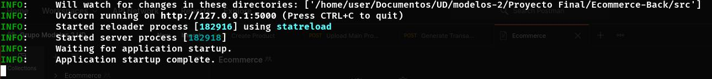

# Ecommerce Server

Servidor en python hecho aplicando distintos paradigmas de programación para manejar la logica de un ecommerce.

## Autores

- Jesus Manuel Leiva Bermudez - **20191020132**
- Sergio David Paez Suarez - **20191020167**
- Jesus Alberto Lozada Montiel- **20191020098**

## Paradigmas de programación utilizados

- Programación Funcional `(modulo funcional de seguridad)`.
- Programación Orientada a objetos `(modulo de clases para mapear la base de datos mediante una orm, asi como controladores para las peticiones http)`.
- Programación Procedimental `(modulo de servicios)`.

## Estructura de archivos
```
├── Dockerfile
├── docker-stack.yml
├── LICENSE
├── private
│   └── secret.json
├── README.MD
├── requirements.txt
├── serve.sh
└── src
    ├── config
    │   ├── databaseConfig.py
    │   ├── firebaseConfig.py
    │   ├── securityConfig.py
    │   └── serverConfig.py
    ├── controller
    │   ├── authController.py
    │   ├── categoryController.py
    │   ├── clientController.py
    │   ├── fileController.py
    │   ├── identifierTypeController.py
    │   ├── productController.py
    │   ├── purchasedController.py
    │   └── transactionController.py
    ├── dto
    │   ├── Auth.py
    │   ├── Category.py
    │   ├── Client.py
    │   ├── IdentifierType.py
    │   ├── Product.py
    │   ├── Purchased.py
    │   └── Transaction.py
    ├── main.py
    ├── model
    │   ├── Client.py
    │   ├── __init__.py
    │   ├── Product.py
    │   └── Transaction.py
    ├── security
    │   ├── authSecurity.py
    │   └── middlewares
    │       └── AuthMiddleware.py
    ├── service
    │   ├── CategoryService.py
    │   ├── ClientService.py
    │   ├── IdentifierTypeService.py
    │   ├── ProductService.py
    │   ├── PurchasedService.py
    │   ├── StorageService.py
    │   └── TransactionServices.py
    └── util
        └── hash.py
```

## Ejecución en modo desarrollo

Primero se debe tener configurado en la raiz del proyecto un archivo `.env` con la siguiente estructura.

```
DB_USER=
DB_PASSWORD=
DB_HOST=
DB_PORT=
DB_NAME=
SECRET=
ALGORITHM=
EXPIRATION_TIME=
PORT=
SECRET_HASH
FIREBASE_BUCKET=
```
Una vez configurado esto puede usar el script `serve.sh` para ejecutar el proyecto (para poder ejecutar el archivo tener en cuenta que su ambiente soporte bash como interprete de linea de comandos).

```console
./serve.sh dev
```

```console
sh serve.sh dev
```

Este script creara el ambiente virtual, instalara las dependencias del proyecto y procedera a ejecutarlo, la salida en terminal debe ser la siguiente.



El proyecto tambien se encuentra dockerizado por lo cual lo puede ejecutarlo de la siguiente forma:

```console
docker build -t ecommerce_server:latest .

docker-compose -f docker-stack.yml up
```

## Documentación de la api

Para ver documentación detallada de los enpoints de la api, una vez ejecutado el proyecto ir a [http://127.0.0.1:${PUERTO_CONFIGURADO}/docs](http://127.0.0.1:5000/docs)
